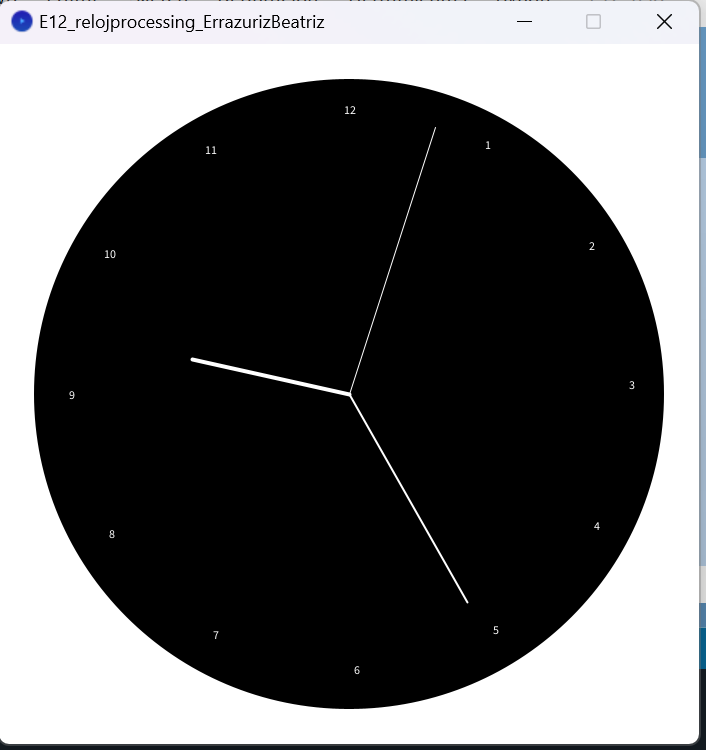

# Processing Clock Project

This project is an interactive clock built using Processing, developed for the *Creative Programming for Design* course during the first semester of 2021 at the Pontifical Catholic University of Chile. The clock displays hours, minutes, and seconds using moving hands on a circular interface, and it includes minute markers for easier time reading.

## Project Context

The goal of this project was to explore the creative possibilities of programming and design, using Processing as the primary tool for building interactive visual applications. This clock combines simple design elements with basic trigonometry to represent time visually.

## How to Run the Project

### Requirements

To run this project, you will need:

- [Processing](https://processing.org/download/) installed on your machine.

### Steps

1. Download or clone the project files.
2. Open the `.pde` file in the Processing IDE.
3. Press the `Run` button (the triangle in the top-left corner of the Processing window) to launch the clock.

### Code Overview

The clock consists of:

- A background clock face represented by a large circle.
- Three hands for seconds, minutes, and hours, each calculated using the `cos()` and `sin()` functions to map the current time to angles.
- Minute markers are placed around the clock for easier reading of the time, and numbers 1 to 12 are displayed at corresponding positions.

The `draw()` function continuously updates the display, ensuring the hands move according to the current time.

### Features

- **Real-time Clock**: The second, minute, and hour hands move in real time.
- **Custom Design**: The clock face is drawn dynamically with ticks and number markers.
